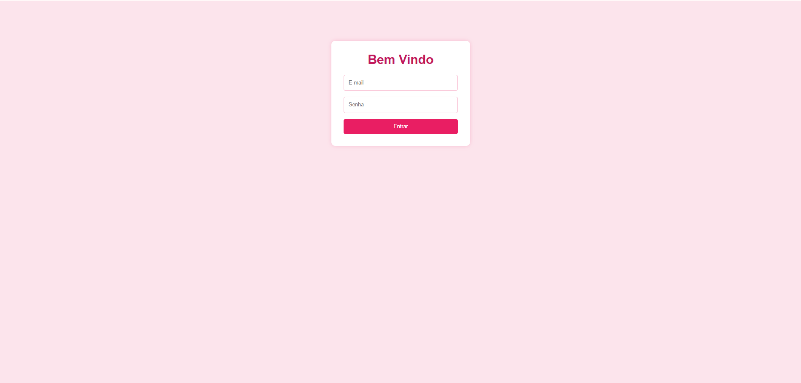
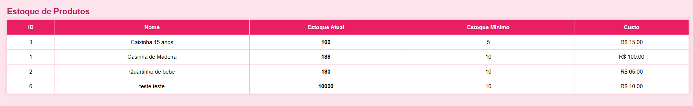
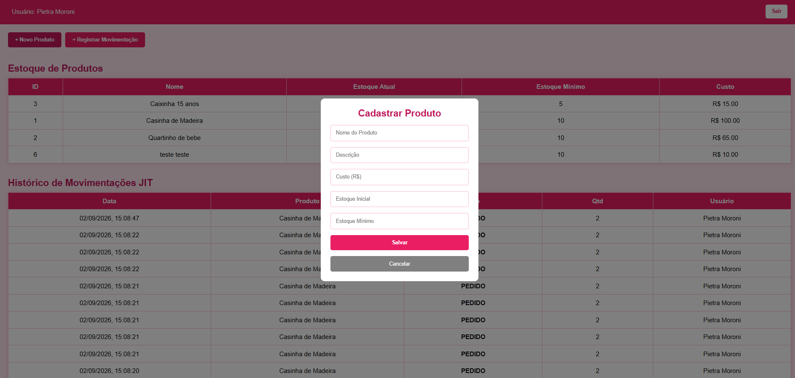
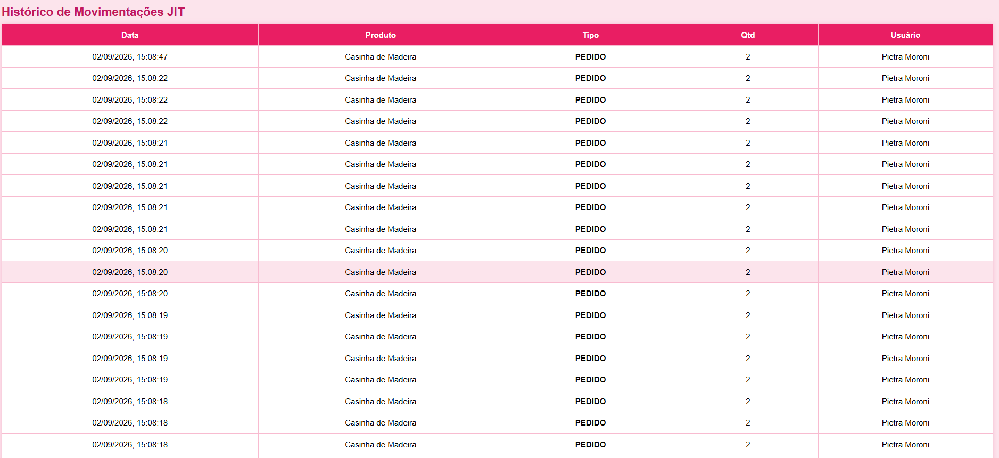
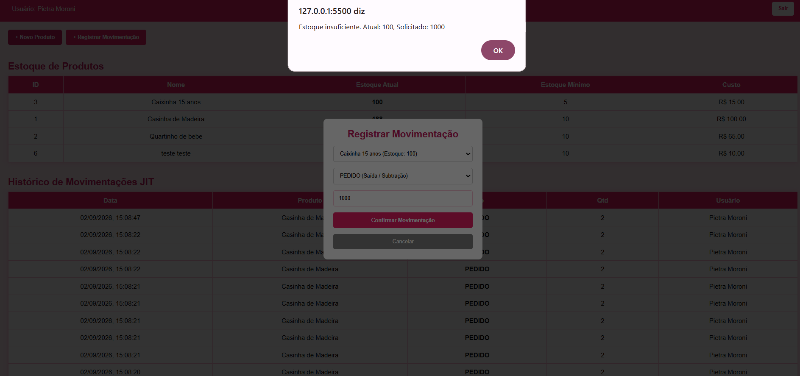
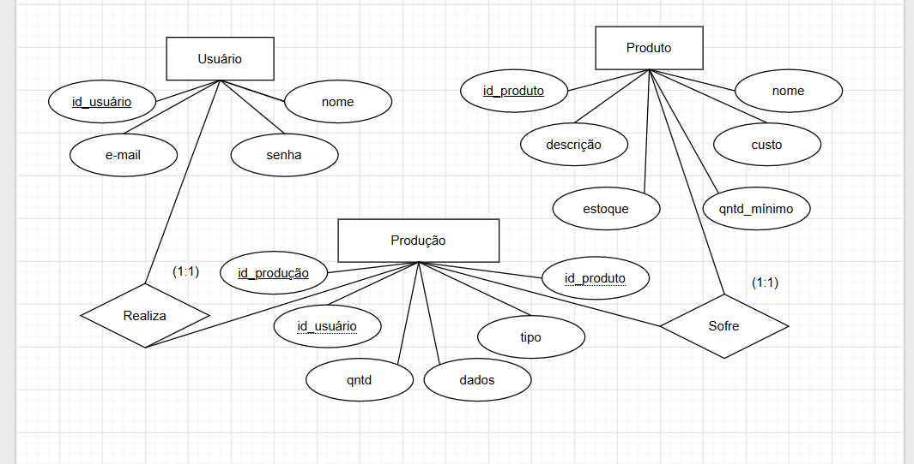

# Sistema de Gestão de Produção Just-in-Time

Documentação técnica, requisitos, matriz de testes e mapa de evidências de desempenho para a aplicação de Gestão de Produção e Estoque baseada no conceito Just-in-Time.
FRONT = pasta "front"
BACK = pasta "just_in_time_01_2026"

---

## 1. Visão Geral do Sistema

O sistema foi desenvolvido utilizando a arquitetura **REST API** para gestão e controle de estoque de produção no modelo *Just-in-Time* (JIT). A solução permite a autenticação de usuários cadastrados, listagem dinâmica e busca de produtos em ordem alfabética, além da movimentação de entradas (`FABRICADO`) e saídas (`PEDIDO`) com verificação e disparo automático de alertas para níveis de estoque abaixo do mínimo configurado.

---

## 2. Tabela de Evidências de Avaliação

| Atividade                                                     | Evidência Observável                                                                                                                                                                               | Capacidade | Peso |   SIM   | NÃO |
| :------------------------------------------------------------ | :------------------------------------------------------------------------------------------------------------------------------------------------------------------------------------------------- | :--------: | :--: | :-----: | :-: |
| **ATIVIDADE 1 – DOCUMENTAÇÃO DE REQUISITOS**                  |                                                                                                                                                                                                    |            |      |         |     |
|                                                               | Desenvolveu o sistema conforme análise de requisitos?                                                                                                                                              |     C6     |   2  | **[X]** | [ ] |
|                                                               | Modelou os requisitos funcionais mínimos conforme descrito?                                                                                                                                        |     C6     |   2  | **[X]** | [ ] |
| **ATIVIDADE 2 – DER**                                         |                                                                                                                                                                                                    |            |      |         |     |
|                                                               | Atribuiu às relações de chaves estrangeiras de acordo com a modelagem do diagrama entidade relacionamento (DER)?                                                                                   |     C4     |   2  | **[X]** | [ ] |
|                                                               | Atribuiu às relações entre as tabelas (ex.: 1:N) no diagrama entidade relacionamento físico (DER)?                                                                                                 |     C4     |   2  | **[X]** | [ ] |
|                                                               | Atribuiu os tipos (ex.: DATE). Se utilizou o modelo lógico, no modelo conceitual é dispensável.                                                                                                    |     C4     |   2  | **[X]** | [ ] |
|                                                               | Modelou no mínimo as entidades Usuário, Produto e Produção?                                                                                                                                        |     C4     |   1  | **[X]** | [ ] |
| **ATIVIDADE 3 – SCRIPT BANCO DE DADOS**                       |                                                                                                                                                                                                    |            |      |         |     |
|                                                               | Criou o banco de dados com o nome especificado no caderno de prova?                                                                                                                                |     C4     |   1  | **[X]** | [ ] |
|                                                               | Criou todas as tabelas modeladas no diagrama entidade relacionamento, respeitando a chave estrangeira (NOT NULL) de cada relacionamento?                                                           |     C4     |   2  | **[X]** | [ ] |
|                                                               | Inseriu pelo menos três registros em cada uma das tabelas criadas no banco de dados?                                                                                                               |     C4     |   2  | **[X]** | [ ] |
| **ATIVIDADE 4 – INTERFACE DE AUTENTICAÇÃO DE USUÁRIO**        |                                                                                                                                                                                                    |            |      |         |     |
|                                                               | Criou uma sessão para o usuário autenticado?                                                                                                                                                       |     C7     |   2  | **[X]** | [ ] |
|                                                               | Desenvolveu a autenticação do usuário, redirecionando-o para a interface principal da aplicação ao inserir login e senha registrados no banco de dados?                                            |     C7     |   3  | **[X]** | [ ] |
|                                                               | Desenvolveu os campos de login, senha e botão Entrar?                                                                                                                                              |     C7     |   2  | **[X]** | [ ] |
|                                                               | Realizou o tratamento de falha de autenticação no login, informando o motivo da falha?                                                                                                             |     C7     |   3  | **[X]** | [ ] |
| **ATIVIDADE 5 – INTERFACE PRINCIPAL**                         |                                                                                                                                                                                                    |            |      |         |     |
|                                                               | Desenvolveu um meio de acessar a interface de cadastro de produto?                                                                                                                                 |     C7     |   1  | **[X]** | [ ] |
|                                                               | Desenvolveu um meio de acessar a interface de gestão de produção (Just in Time)?                                                                                                                   |     C7     |   1  | **[X]** | [ ] |
|                                                               | Desenvolveu um meio para sair do sistema, direcionando à interface de login?                                                                                                                       |     C7     |   1  | **[X]** | [ ] |
| **ATIVIDADE 6 – INTERFACE CADASTRO DE PRODUTO**               |                                                                                                                                                                                                    |            |      |         |     |
|                                                               | Desenvolveu a programação de listar os produtos cadastrados ao carregar a interface de cadastro de produto?                                                                                        |     C7     |   2  | **[X]** | [ ] |
|                                                               | Desenvolveu a programação para a inserção de um novo produto no banco de dados?                                                                                                                    |     C7     |   2  | **[X]** | [ ] |
|                                                               | Desenvolveu a programação para excluir um produto já existente no banco de dados?                                                                                                                  |     C7     |   2  | **[X]** | [ ] |
|                                                               | Desenvolveu a programação para validar os dados no cadastro e na atualização do produto?                                                                                                           |     C7     |   3  | **[X]** | [ ] |
|                                                               | Desenvolveu um meio de o usuário retornar à interface principal?                                                                                                                                   |     C7     |   1  | **[X]** | [ ] |
| **ATIVIDADE 7 – INTERFACE GESTÃO DE PRODUÇÃO (JUST IN TIME)** |                                                                                                                                                                                                    |            |      |         |     |
|                                                               | Desenvolveu a programação para o usuário selecionar o produto e selecionar se o produto foi pedido (entrar) ou produzido (sair) no estoque? (Atualizando o campo quantidade na tabela de produtos) |     C7     |   2  | **[X]** | [ ] |
|                                                               | Desenvolveu a programação para que o usuário possa inserir a data de movimentação de entrada ou saída?                                                                                             |     C7     |   3  | **[X]** | [ ] |
|                                                               | Implementou a verificação automática, gerando o alerta de estoque abaixo do mínimo configurado?                                                                                                    |     C7     |   3  | **[X]** | [ ] |
| **ATIVIDADE 8 – CASOS DE TESTES**                             |                                                                                                                                                                                                    |            |      |         |     |
|                                                               | Descreveu ferramentas e ambiente de testes?                                                                                                                                                        |     C8     |   2  | **[X]** | [ ] |
|                                                               | Descreveu os casos de testes para cada requisito funcional?                                                                                                                                        |     C8     |   2  | **[X]** | [ ] |
|                                                               | Executou testes em cada requisito funcional conforme casos de teste?                                                                                                                               |     C8     |   2  | **[X]** | [ ] |
| **ATIVIDADE 9 – DOCUMENTAÇÃO DE INFRAESTRUTURA**              |                                                                                                                                                                                                    |            |      |         |     |
|                                                               | Identificou a linguagem de programação e a versão no desenvolvimento do sistema?                                                                                                                   |     C1     |   1  | **[X]** | [ ] |
|                                                               | Identificou o SGBD (Sistema Gerenciador de Banco de Dados) utilizado e sua respectiva versão para a criação do banco de dados no servidor?                                                         |     C1     |   1  | **[X]** | [ ] |
|                                                               | Identificou o sistema operacional e sua versão para o desenvolvimento da aplicação?                                                                                                                |     C1     |   1  | **[X]** | [ ] |

---

## 3. Requisitos Funcionais

### ENTREGA 01 – LISTA DE REQUISITOS FUNCIONAIS

### [RF01] Interface de autenticação de usuários

* **[RF01.1]** Solicitar e-mail e senha do usuário.
* **[RF01.2]** Validar as credenciais do usuário com os dados cadastrados no banco de dados.
* **[RF01.3]** Informar ao usuário quando houver falha na autenticação.
* **[RF01.4]** Criar uma sessão para o usuário autenticado.
* **[RF01.5]** Redirecionar o usuário autenticado para a interface principal do sistema.

### [RF02] Interface principal do sistema

* **[RF02.1]** Exibir o nome do usuário autenticado.
* **[RF02.2]** Disponibilizar menu ou opção de acesso ao cadastro de produtos.
* **[RF02.3]** Disponibilizar menu ou opção de acesso à gestão de produção (Just in Time).
* **[RF02.4]** Disponibilizar opção de logout.
* **[RF02.5]** Redirecionar o usuário para a tela de login após realizar o logout.

### [RF03] Cadastro e gerenciamento de produtos

* **[RF03.1]** Listar os produtos cadastrados no banco de dados ao acessar a interface.
* **[RF03.2]** Exibir os produtos cadastrados em formato de tabela.
* **[RF03.3]** Disponibilizar campo de busca de produtos.
* **[RF03.4]** Atualizar a listagem conforme o termo informado na busca.
* **[RF03.5]** Permitir o cadastro de um novo produto.
* **[RF03.6]** Permitir a edição de um produto existente.
* **[RF03.7]** Permitir a exclusão de um produto existente.
* **[RF03.8]** Armazenar o nome do produto.
* **[RF03.9]** Armazenar a descrição do produto.
* **[RF03.10]** Armazenar o custo do produto.
* **[RF03.11]** Armazenar a quantidade atual do produto em estoque.
* **[RF03.12]** Armazenar a quantidade mínima de estoque configurada para o produto.
* **[RF03.13]** Validar os dados informados no cadastro de produtos.
* **[RF03.14]** Validar os dados informados na alteração de produtos.
* **[RF03.15]** Exibir alertas quando os dados estiverem ausentes ou forem inválidos.
* **[RF03.16]** Disponibilizar opção para retornar à interface principal.

### [RF04] Gestão de produção e movimentação de estoque

* **[RF04.1]** Listar os produtos cadastrados em ordem alfabética.
* **[RF04.2]** Permitir a seleção do produto que terá movimentação de estoque.
* **[RF04.3]** Permitir selecionar o tipo de movimentação: produto fabricado ou produto pedido.
* **[RF04.4]** Permitir informar a data da movimentação.
* **[RF04.5]** Registrar a quantidade de produtos fabricados.
* **[RF04.6]** Registrar a quantidade de produtos pedidos.
* **[RF04.7]** Aumentar a quantidade disponível em estoque quando um produto for fabricado.
* **[RF04.8]** Diminuir a quantidade disponível em estoque quando um produto for pedido.
* **[RF04.9]** Registrar a movimentação de produção no banco de dados.
* **[RF04.10]** Registrar o usuário responsável pela movimentação.
* **[RF04.11]** Registrar a data e a quantidade da movimentação.
* **[RF04.12]** Verificar automaticamente o estoque após uma saída de produtos.
* **[RF04.13]** Exibir um alerta quando o estoque ficar abaixo da quantidade mínima configurada.
* **[RF04.14]** Permitir acompanhar as movimentações de produção e pedidos.

### [RF05] Controle de usuários e ações

* **[RF05.1]** Identificar o usuário responsável por cada ação realizada no sistema.
* **[RF05.2]** Registrar o usuário responsável pelas movimentações de estoque.
* **[RF05.3]** Manter o acesso às funcionalidades do sistema condicionado à autenticação do usuário.

---

# 4. Requisitos de Infraestrutura

* **Linguagem de Programação e Versão:** Node.js (v20.x ou superior / ES6+)
* **Framework Backend:** Express.js
* **ORM:** Prisma ORM
* **SGBD (Sistema Gerenciador de Banco de Dados) e Versão:** MySQL Server (v8.0)
* **Sistema Operacional do Ambiente de Desenvolvimento:** Windows 11 / Linux / macOS

## Ambiente de Desenvolvimento

* **Sistema Operacional:** Microsoft Windows 11 Pro / 64-bits (ou Linux Ubuntu 22.04 LTS / macOS Sonoma)
* **Ambiente de Execução (Runtime):** Node.js `v20.x` LTS (gerenciador de pacotes `npm v10.x`)
* **Editor de Código / IDE:** Visual Studio Code (VS Code) com extensões *Prisma*, *ESLint* e *Thunder Client*

## Banco de Dados (SGBD)

* **Sistema Gerenciador de Banco de Dados:** MySQL Server `v8.0` (ou MariaDB `v10.11`)
* **Porta Padrão:** `3306`
* **Ferramenta de Modelagem / Gestão:** MySQL Workbench `v8.0` / Prisma Studio

## Tecnologias e Dependências da Aplicação

* **Linguagem de Programação:** JavaScript (ECMAScript 2023 / ES6+)
* **Mapeamento Objeto-Relacional (ORM):** Prisma ORM `v5.x`
* **Framework Web Backend:** Express.js `v4.x`
* **Biblioteca de CORS:** `cors` `v2.8.5` (para liberação de requisições Cross-Origin no frontend)

## Especificações de Rede e Portas

* **Servidor Backend (API REST):** `http://localhost:3000`
* **Servidor Frontend:** Execução via protocolo HTTP local (`http://127.0.0.1:5500` via Live Server) ou protocolo de arquivo local (`file:///`)

---

# 5. Schema do Prisma (ORM)

```prisma
generator client {
  provider = "prisma-client-js"
}

datasource db {
  provider = "mysql"
}

model Usuario {
  id    Int    @id @default(autoincrement())
  nome  String
  email String @unique
  senha String

  producoes Producao[]
}

model Produto {
  id         Int     @id @default(autoincrement())
  nome       String
  descricao  String?
  custo      Float
  estoque    Int
  qntdMinimo Int

  producoes Producao[]
}

model Producao {
  id    Int      @id @default(autoincrement())
  qntd  Int
  tipo  String
  dados DateTime @default(now())

  usuarioId Int
  produtoId Int

  usuario Usuario @relation(fields: [usuarioId], references: [id])
  produto Produto @relation(fields: [produtoId], references: [id])
}
```

---

# 6. Casos de Teste

## Ferramentas e Ambiente de Testes

* **Ferramentas:** Insomnia / Postman / Browser DevTools (Console e Network)
* **Ambiente de Testes:** Servidor Node.js local executando na porta `3000`, integrado com banco de dados MySQL via Prisma.

## 6.1 Descrição do Ambiente de Testes

* **Ambiente de Desenvolvimento:** Node.js (v18+), Express.js.
* **Banco de Dados:** MySQL (`preparacao_db`) gerenciado via Prisma ORM.
* **Ferramenta de Execução de Testes de API:** Insomnia / Postman / VS Code REST Client.
* **Ferramenta de Validação do Banco de Dados:** Prisma Studio (`npx prisma studio`) e MySQL Workbench.
* **Servidor Local:** Executado via `node server.js` em `http://localhost:3000`.

---

## 6.2 Casos de Teste por Requisito Funcional

# RF01 – Autenticação e Controle de Acesso

### CT01.1 – Login com Sucesso

**Entrada:**

`POST /usuarios/login`

```json
{
  "email": "admin@teste.com",
  "senha": "123"
}
```

**Como testar:**

1. Iniciar o servidor Node.js.
2. Abrir o Insomnia, Postman ou outra ferramenta de testes de API.
3. Criar uma requisição do tipo `POST`.
4. Informar a URL `http://localhost:3000/usuarios/login`.
5. Selecionar o formato JSON no corpo da requisição.
6. Informar um e-mail e senha válidos cadastrados no sistema.
7. Enviar a requisição.
8. Verificar o código de resposta e os dados retornados.

**Resultado Esperado:**

Status `200 OK`, mensagem de sucesso e dados do usuário retornados.

---

### CT01.2 – Login com Credenciais Inválidas

**Entrada:**

`POST /usuarios/login`

```json
{
  "email": "admin@teste.com",
  "senha": "errada"
}
```

**Como testar:**

1. Abrir o Insomnia ou Postman.
2. Criar uma requisição `POST`.
3. Informar a URL `http://localhost:3000/usuarios/login`.
4. Informar um e-mail válido e uma senha incorreta.
5. Enviar a requisição.
6. Verificar o código de resposta retornado.
7. Conferir a mensagem apresentada ao usuário.

**Resultado Esperado:**

Status `401 Unauthorized` e mensagem **"Credenciais inválidas"**.

---

### CT01.3 – Cadastro de Usuário

**Entrada:**

`POST /usuarios/cadastrar`

```json
{
  "nome": "Operador",
  "email": "op@teste.com",
  "senha": "123"
}
```

**Como testar:**

1. Abrir o Insomnia ou Postman.
2. Criar uma requisição `POST`.
3. Informar a URL `http://localhost:3000/usuarios/cadastrar`.
4. Selecionar o corpo da requisição no formato JSON.
5. Informar nome, e-mail e senha válidos.
6. Enviar a requisição.
7. Verificar a resposta da API.
8. Consultar o banco de dados pelo Prisma Studio ou MySQL Workbench para confirmar o cadastro.

**Resultado Esperado:**

Status `201 Created` e confirmação de cadastro. O novo usuário deve estar armazenado no banco de dados.

---

# RF02 & RF03 – Gestão de Produtos

### CT02.1 – Cadastrar Produto Válido

**Entrada:**

`POST /produtos/cadastrar`

```json
{
  "nome": "Peça A",
  "custo": 15.50,
  "estoque": 50,
  "qntdMinimo": 10
}
```

**Como testar:**

1. Acessar a aplicação.
2. Realizar login com um usuário válido.
3. Acessar a tela de cadastro de produtos.
4. Preencher o nome do produto.
5. Informar o custo `15,50`.
6. Informar estoque inicial `50`.
7. Informar quantidade mínima `10`.
8. Salvar o produto.
9. Conferir se o produto aparece na listagem.
10. Verificar o registro no banco de dados, se necessário.

**Resultado Esperado:**

Status `201 Created` e retorno do objeto do produto.

---

### CT02.2 – Cadastrar Produto com Dados Inválidos

**Entrada:**

`POST /produtos/cadastrar`

```json
{
  "nome": "Peça B",
  "custo": -5,
  "estoque": 10,
  "qntdMinimo": 2
}
```

**Como testar:**

1. Acessar a tela de cadastro de produtos.
2. Informar um nome válido.
3. Informar um custo negativo, como `-5`.
4. Preencher os demais campos.
5. Tentar salvar o produto.
6. Verificar a resposta da API ou a mensagem exibida na interface.
7. Conferir se o produto inválido não foi inserido no banco de dados.

**Resultado Esperado:**

Status `400 Bad Request` com mensagem de erro de validação.

---

### CT02.3 – Listar Produtos

**Entrada:**

`GET /produtos/listar`

**Como testar:**

1. Garantir que existam vários produtos cadastrados no banco.
2. Abrir o Insomnia ou Postman.
3. Criar uma requisição `GET`.
4. Informar a URL `http://localhost:3000/produtos/listar`.
5. Enviar a requisição.
6. Verificar a lista de produtos retornada.
7. Conferir se os nomes dos produtos estão organizados em ordem alfabética.
8. Validar também o resultado diretamente na interface de produtos.

**Resultado Esperado:**

Status `200 OK` e lista de produtos em ordem alfabética.

---

# RF04 & RF05 – Movimentação de Estoque e Alertas de Produção

### CT04.1 – Entrada de Estoque (FABRICADO)

**Entrada:**

`POST /producao/registrar`

```json
{
  "usuarioId": 1,
  "produtoId": 1,
  "tipo": "FABRICADO",
  "qntd": 20
}
```

**Como testar:**

1. Verificar a quantidade atual do produto no banco de dados.
2. Abrir o Insomnia ou Postman.
3. Criar uma requisição `POST`.
4. Informar a URL `http://localhost:3000/producao/registrar`.
5. Informar um `usuarioId` válido.
6. Informar um `produtoId` válido.
7. Selecionar o tipo de movimentação `FABRICADO`.
8. Informar a quantidade `20`.
9. Enviar a requisição.
10. Consultar novamente o estoque do produto.
11. Conferir se a movimentação foi registrada no banco de dados.

**Resultado Esperado:**

Status `201 Created`, aumento na quantidade em estoque do produto e registro da movimentação no banco de dados.

---

### CT04.2 – Saída de Estoque (PEDIDO) com Alerta de Estoque Baixo

**Entrada:**

`POST /producao/registrar` solicitando uma saída que deixe o estoque total menor que `qntdMinimo`.

**Como testar:**

1. Consultar o estoque atual do produto.
2. Consultar a quantidade mínima configurada (`qntdMinimo`).
3. Abrir a tela de movimentações.
4. Selecionar um produto cadastrado.
5. Selecionar o tipo de movimentação `PEDIDO`.
6. Informar uma quantidade que faça o estoque ficar abaixo do mínimo.
7. Informar a data da movimentação, quando disponível.
8. Confirmar o registro da movimentação.
9. Verificar a nova quantidade de estoque.
10. Conferir se o alerta de estoque mínimo foi apresentado na interface ou retornado pela API.

**Resultado Esperado:**

Status `201 Created`, decremento no estoque e campo de `alerta` retornado na resposta da requisição. A interface deve informar que o estoque está abaixo do mínimo configurado.

---

### CT04.3 – Saída de Estoque sem Saldo Suficiente

**Entrada:**

`POST /producao/registrar` com `qntd` superior ao estoque atual.

**Como testar:**

1. Consultar a quantidade atual disponível em estoque.
2. Abrir a tela de movimentação de estoque ou a ferramenta de testes de API.
3. Selecionar um produto existente.
4. Selecionar o tipo de movimentação `PEDIDO`.
5. Informar uma quantidade superior ao estoque disponível.
6. Tentar confirmar a movimentação.
7. Verificar a resposta retornada pela API.
8. Conferir se a quantidade do estoque permaneceu inalterada.
9. Conferir se a movimentação não foi registrada no banco de dados.

**Resultado Esperado:**

Status `400 Bad Request` com mensagem **"Estoque insuficiente"**. A movimentação não deve ser registrada e o estoque não deve ficar negativo.

---

## 6.3 Resumo da Execução dos Testes

| Caso de Teste | Requisito | Situação Esperada                                   |
| :------------ | :-------- | :-------------------------------------------------- |
| CT01.1        | RF01      | Login realizado com sucesso                         |
| CT01.2        | RF01      | Login bloqueado com credenciais inválidas           |
| CT01.3        | RF01      | Usuário cadastrado com sucesso                      |
| CT02.1        | RF02/RF03 | Produto cadastrado com sucesso                      |
| CT02.2        | RF03      | Cadastro inválido rejeitado                         |
| CT02.3        | RF03      | Produtos listados em ordem alfabética               |
| CT04.1        | RF04/RF05 | Estoque aumentado após fabricação                   |
| CT04.2        | RF04      | Estoque reduzido e alerta de estoque mínimo exibido |
| CT04.3        | RF04      | Saída bloqueada por estoque insuficiente            |

---

# 7. Evidências Visuais (Prints do Frontend)

## Tela de Login



## Interface Principal / Listagem de Produtos



## Cadastro de Produtos



## Movimentações



## Modal de Registro de Movimentação (Com alerta de Estoque Mínimo)



---

# 8. Diagrama do Banco de Dados (DER)



---

# Credenciais de Acesso para Testes

Para realizar os testes da aplicação e navegar pelas interfaces do sistema, utilize uma das contas pré-cadastradas no banco de dados abaixo:

| Usuário    | E-mail de Acesso   | Senha  | Nível / Perfil               |
| :--------- | :----------------- | :----- | :--------------------------- |
| **Pietra** | `pietra@gmail.com` | `p123` | Administrador / Operador JIT |
| **Teste**  | `teste@gmail.com`  | `t123` | Operador de Estoque          |
| **SAEP**   | `saep@gmail.com`   | `s123` | Avaliador / Leitor           |

> **Instruções:** Acesse a tela inicial de login (`index.html`), insira o e-mail e a senha correspondentes e clique em **Entrar** para ser redirecionado ao painel principal (`index2.html`).
